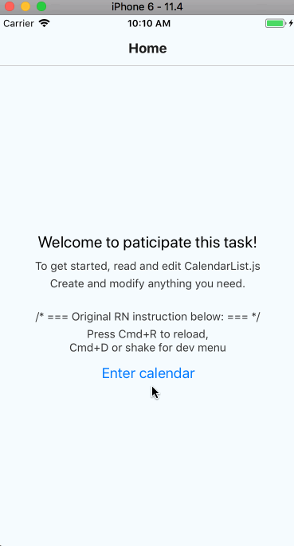

## How to run this sample project:

- Read all posts and tutorials about RN;
- Clone this repo;
- Install node modules and start RN client server;
- If any trouble encounted, please try clean/rebuild.

## Requirements for assignments:

- Finally you will need to implement a month calendar like below:
  

- Show up to **72 month** before current month, and **12 months** after current month;
- Show date tiles in each month correctly;
- Today need to be shown as string **'今'** instead of a date of month number;
- Good enought performance in calendar initialization and user interaction (scrolling).
  
## Tips:
- Notice that the height of each month tile varies;
- Write good comments and docstrings could help the reviewer understand your code better.
  
## Advanced requirements:

They are optinal, bonus will be credited if you archieve any of them.

Please write clear explanation if you finish advanced requirements.

- Could you make the calender scrollable infinitely?
- Is there any feature in `FlatList` could reduce unnecessary rendering or processing?
- Imitate [共乐孕 App](http://a.app.qq.com/o/simple.jsp?pkgname=com.glow.android.gongleyun) to implement editing periods function;
- Scroll back to `today` by clicking a floating button; 
- Any ideas could accelerate app and optimize memory usage are great.

# Happy coding!
